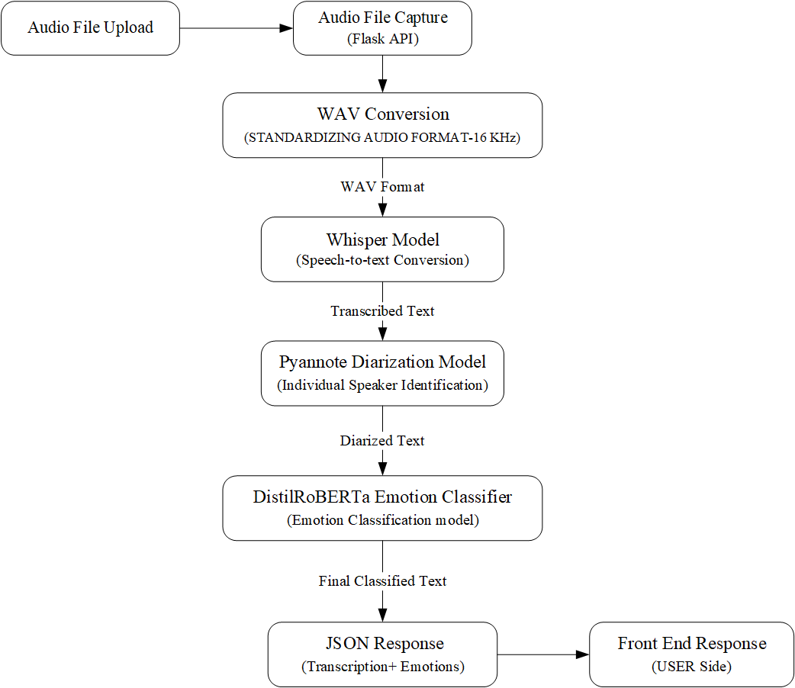
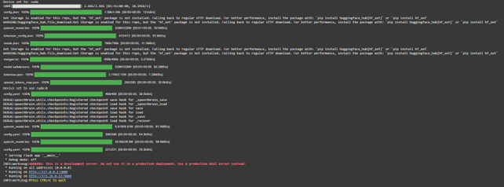
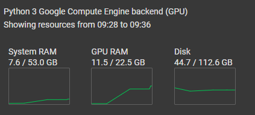
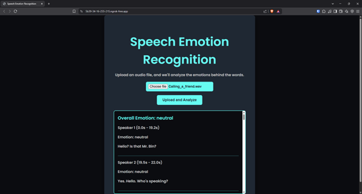

# 📢 Speech Emotion Recognition with Speaker Diarization and Emotion Analysis - Patent Filed / Patent Pending

This project integrates **speech-to-text transcription**, **speaker diarization**, and **emotion recognition** into a single system using state-of-the-art AI models. It enables real-time emotional analysis of conversations with multiple speakers and outputs both per-speaker emotion timelines and overall sentiment analysis.

---

## Project Preview

### System Architecture



---

## Features

- 🎙️ Real-time speech-to-text using OpenAI’s **Whisper**
- 👥 Speaker Diarization via **pyannote.audio**
- 😊 Emotion classification with **RoBERTa** and **DistilBERT**
- 📊 Intuitive web dashboard with emotion timelines and sentiment summaries
- 🔐 Secure audio handling with GDPR-compliant design
- ⚡ GPU-accelerated processing pipeline

---

## Tech Stack

| Component               | Technology                             |
|------------------------|-----------------------------------------|
| Backend                | Python, Flask                           |
| ML Models              | Whisper, Pyannote, RoBERTa, DistilBERT |
| Audio Processing       | LibROSA, PyDub                         |
| Frontend               | HTML5, CSS3, JavaScript                |
| Deployment             | Docker, AWS/GCP                        |

---

## 💻 Installation & Setup

```bash
git clone https://github.com/yourusername/speech-emotion-recognition.git
cd speech-emotion-recognition

# Setup environment
python3 -m venv SER
Windows: .\SER\Scripts\activate
Linux: source SER/bin/activate
pip install -r requirements.txt

# Run the app
python main.py
```


---

## How It Works

1. **Upload Audio**: Accepts `.wav`, `.mp3`, `.mp4`, and `.m4a` files.
2. **Preprocessing**: Audio converted to 16kHz mono WAV, noise-reduced.
3. **Diarization**: Segments and labels each speaker.
4. **Transcription**: Uses Whisper to generate text from audio.
5. **Emotion Analysis**: Uses Hugging Face transformers to detect emotion per speaker segment.
6. **Output**: Speaker-wise emotion breakdown and overall call sentiment.

---

## Results

### Model Loading



### System Usage Graph



### Web Dashboard



---


## Future Work

- 🔊 Add acoustic-based emotion cues (pitch, MFCCs)
- 📈 Advanced dashboards with charts (e.g., Plotly.js)
- 🔁 Real-time streaming analysis
- 🤖 Multimodal (facial + vocal) emotion detection


---


## Ethical Considerations

- GDPR/CCPA compliant data handling
- Bias audits across accents, genders


---


## References

1. [Whisper by OpenAI](https://github.com/openai/whisper)
2. [pyannote.audio](https://github.com/pyannote/pyannote-audio)
3. [Hugging Face Transformers](https://huggingface.co/models)


---


## Author

**Sanjay S**  
B.Tech - Information Technology  
VIT Vellore  
Under guidance of Dr. Vellingiri J

